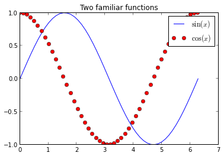

# Notebook example

Rendered by vIPer using [Reveal.js](http://lab.hakim.se/reveal-js)!

(also you can get a [pdf](http://www.slideviper.oquanta.info/reveal/slides.pdf) version with chrome!)

---

## NOTE: This notebook was modified from a Fernando's one

Since the notebook was introduced with [IPython 0.12](http://ipython.org/ipython-doc/rel-0.12.1/whatsnew/version0.12.html), it has proved to be very popular, and we are seeing great adoption of the tool and the underlying file format in research and education.  One persistent question we've had since the beginning (even prior to its official release) was whether it would be possible to easily write blog posts using the notebook.

---

The combination of easy editing in markdown with the notebook's ability to contain code, figures and results, makes it an ideal platform for quick authoring of  technical documents, so being able to post to a blog is a natural request.

---

Today, in answering a query about this from a colleague, I decided to try again the status of our conversion pipeline, and I'm happy to report that with a bit of elbow-grease, at least on Blogger things work pretty well!  

This post was *entirely* written as a notebook, and in fact I have now created a [github repo](https://github.com/fperez/blog), which means that you can see it directly [rendered in IPyhton's nbviewer app](http://nbviewer.ipython.org/urls/raw.github.com/fperez/blog/master/120907-Blogging with the IPython Notebook.ipynb).

---

## Converting your notebook to html with nbconvert

The first thing you will need is our [nbconvert](https://github.com/ipython/nbconvert) tool that converts notebooks across formats.  The README file in the repo contains the requirements for nbconvert (basically [python-markdown](http://pypi.python.org/pypi/Markdown/), [pandoc](http://johnmacfarlane.net/pandoc), [docutils from SVN](http://docutils.svn.sourceforge.net/viewvc/docutils/trunk/docutils/?view=tar) and [pygments](http://pygments.org)).

Once you have nbconvert installed, you can convert your notebook to Blogger-friendly html with:

    nbconvert -f blogger-html your_notebook.ipynb

---

This will leave two files in your computer, one named `your_notebook.html` and one named `your_noteboook_header.html`; it might also create a directory called `your_notebook_files` if needed for ancillary files.  The first file will contain the body of your post and can be pasted wholesale into the Blogger editing area. The second file contains the CSS and Javascript material needed for the notebook to display correctly, you should only need to use this once to configure your blogger setup (see next):

---

    # Only one notebook so far
    (master)longs[blog]> ls
    120907-Blogging with the IPython Notebook.ipynb  fig/  old/
    
    # Now run the conversion:
    (master)longs[blog]> nbconvert.py -f blogger-html 120907-Blogging\ with\ the\ IPython\ Notebook.ipynb
    
    # This creates the header and html body files
    (master)longs[blog]> ls
    120907-Blogging with the IPython Notebook_header.html  fig/
    120907-Blogging with the IPython Notebook.html         old/
    120907-Blogging with the IPython Notebook.ipynb

---

## Configuring your Blogger blog to accept notebooks

The notebook uses a lot of custom CSS for formatting input and output, as well as Javascript from [MathJax](http://www.mathjax.org) to display mathematical notation.  You will need all this CSS and the Javascript calls in your blog's configuration for your notebook-based posts to display correctly:

---

1. Once authenticated, go to your blog's overview page by clicking on its title.
2. Click on templates (left column) and customize using the Advanced options.
3. Scroll down the middle column until you see an "Add CSS" option.
4. Copy entire the contents of the `_header` file into the CSS box.

---

That's it, and you shouldn't need to do anything else as long as the CSS we use in the notebooks doesn't drastically change.  This customization of your blog needs to be done only once.

While you are at it, I recommend you change the width of your blog so that cells have enough space for clean display; in experimenting I found out that the default template was too narrow to properly display code cells, producing a lot of text wrapping that impaired readability.  I ended up using a layout with a single column for all blog contents, putting the blog archive at the bottom.  Otherwise, if I kept the right sidebar, code cells got too squished in the post area.

---

I also had problems using some of the fancier templates available from 'Dynamic Views', in that I could never get inline math to render.  But sticking to those from the Simple or 'Picture Window' categories worked fine and they still allow for a lot of customization.

*Note:* if you change blog templates, Blogger does destroy your custom CSS, so you may need to repeat the above steps in that case.

---

## Adding the actual posts

Now, whenever you want to write a new post as a notebook, simply convert the `.ipynb` file to blogger-html and copy its entire contents to the clipboard. Then go to the 'raw html' view of the post, remove anything Blogger may have put there by default, and paste.  You should also click on the 'options' tab (right hand side) and select both `Show HTML literally` and `Use   tag`, else your paragraph breaks will look all wrong.

That's it!

---

## What can you put in?

I will now add a few bits of code, plots, math, etc, to show which kinds of content can be put in and work out of the box.  These are mostly bits copied from our [example notebooks](https://github.com/ipython/ipython/tree/master/docs/examples/notebooks) so the actual content doesn't matter, I'm just illustrating the *kind* of content that works.

    In[7]: # Let's initialize pylab so we can plot later
           %pylab inline

    
    Welcome to pylab, a matplotlib-based Python environment [backend: module://IPython.zmq.pylab.backend_inline].
    For more information, type 'help(pylab)'.

---

With pylab loaded, the usual matplotlib operations work

    In[8]: x = linspace(0, 2*pi)
           plot(x, sin(x), label=r'$\sin(x)$')
           plot(x, cos(x), 'ro', label=r'$\cos(x)$')
           title(r'Two familiar functions')
           legend()

<pre>
    <matplotlib.legend.Legend at 0x9d583ec>
</pre>

---

The notebook, thanks to MathJax, has great LaTeX support, so that you can type inline math $(1,\gamma,\ldots, \infty)$ as well as displayed equations:

$$
e^{i \pi}+1=0
$$

**(the last equation is beatiful, isn't it?... Damián talking... he he!)**

---

## You can easily include formatted text and code with markdown

You can *italicize*, **boldface**

* build 
* lists

and embed code meant for illustration instead of execution in Python:

    def f(x):
        """a docstring"""
        return x**2

---

or other languages:

    if (i=0; i<n; i++) {
      printf("hello %d\n", i);
      x += 4;
    }

**And you also have highlight for your code, hehe! (Damián talking again...)**

---

And since the notebook can store displayed images in the file itself, you can show images which will be embedded in your post:

---

# IPython rocks!

Just my little contribution...

I have a lot of work to do but this is an exciting beginning!

You can check [vIPer](http://www.viperapp.oquanta.info).

And you can find me at:

* [@damian_avila](https://twitter.com/damian_avila)
* [OQUANTA](http://www.oquanta.info)
* [BLOG](http://www.damian.oquanta.info)

